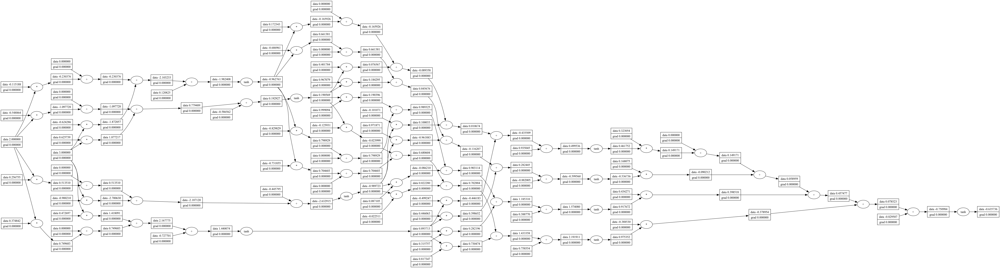

# micrograd in CPP

- Inspired by Andrej Karpathy's lecture: https://www.youtube.com/watch?v=VMj-3S1tku0
- Original micrograd repo: https://github.com/karpathy/micrograd

This repo exists to:

- Relearn and solidify my understanding of basic ML concepts from the ground up
- Get better at C++ while doing it
- End up with something useful for educational purposes, mine first, maybe someone else's later

The plan is to build a working autograd engine that implements reverse-mode autodiff over tensors, a small neural network library on top of it, and a live demo of a trained NN: an interactive canvas where you draw a digit and tells you what it sees in real time.

The static webapp ships as vanilla HTML plus a WASM module with the trained weights baked in, totalling a few hundred KB at most.

The browser fetches it once on page load and runs the WASM locally.

As I build, I'll most probably hit concepts I'm meeting fresh and concepts I'm meeting again with more context. I learn best by writing things down and explaining them, so the deeper notes will live on my blog: www.zoricl.io

Live demo: TODO

### API

The library has two layers:

**Value** is the autograd engine. It tracks a computation graph and computes gradients automatically via backpropagation. You create values, do math with normal operators, and call `.backward()` on the result, gradients flow back through the entire graph.

```cpp
auto a = Value::create(2.0);
auto b = Value::create(3.0);
auto c = (a * b) + a;
c->backward();
// a->grad() and b->grad() now hold dc/da and dc/db
```

Supported operations: `+`, `-`, `*`, `/`, `pow`, `tanh`, `exp`. All of them are differentiable and composable, you can chain them however you like and backward will still work.

**MLP** is a small neural network built on top of Value. You declare the shape, call it like a function, and get predictions out.

```cpp
MLP mlp(3, {4, 4, 1});  // 3 inputs, two hidden layers of 4, one output
auto prediction = mlp(inputs)[0];
```

`mlp.parameters()` returns every weight and bias in the network, which is what you iterate over during training to zero gradients and update weights.

Value is the engine, MLP is one thing built with it. You could use Value alone to build any differentiable computation you want.

### Usability

#### Visualising expressions

Change expression in `main.cpp` by adjusting the values and expression using the values. The output layer of an MLP is itself just a Value expression, so you can feed it straight into the graph.

`make graph` will compile everything, run it, and open a visual graph of the computation.

```
std::vector<std::shared_ptr<Value>> x = {Value::create(2.0), Value::create(3.0)};
MLP mlp(2, std::vector<int>{4, 4, 1});
```

Running `make graph` shows:



#### Training loop

`manual_loss.cpp` has a bare-bones training loop you can step through by hand. 

You can run it with `make training-sim`.

It runs a forward pass, computes the loss, backpropagates, and nudges the parameters. 

Each time you press Enter you see the updated loss and predictions. 

Press `q` to quit.

```
Step 68

Loss: 0.0109251
  pred[0]: 0.95298      (target: 1)
  pred[1]: -0.99165     (target: -1)
  pred[2]: -0.935884    (target: -1)
  pred[3]: 0.932667     (target: 1)

Press Enter for next step (q to quit)...

```